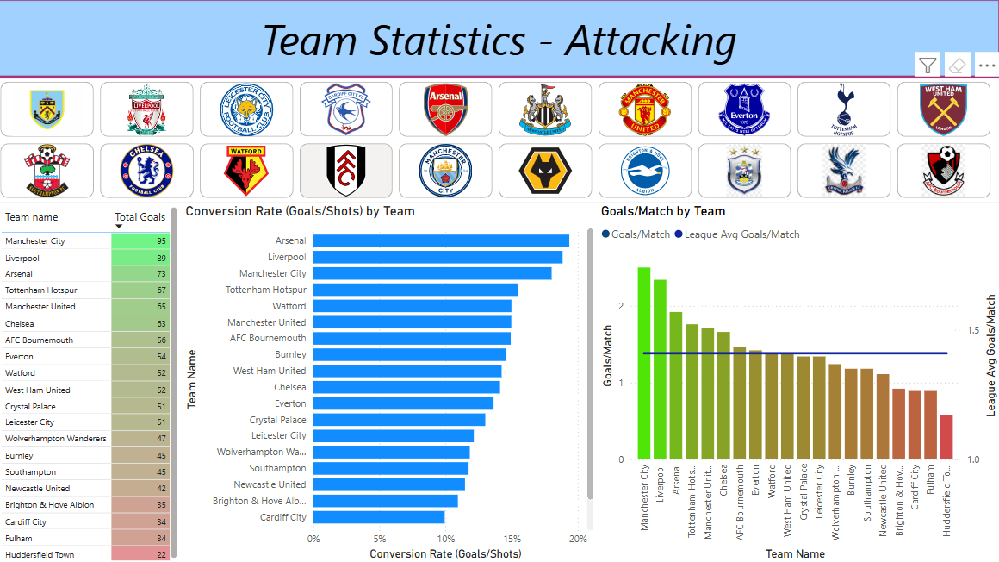

# ⚽ Premier League 2018/2019 Season Analysis Dashboard

This Power BI dashboard explores the 2018/2019 English Premier League (soccer) season, with a focus on team and player performance. The project uses visual analytics to break down attacking and defensive trends, player contributions, and overall team standings.

## 📊 Dashboard Overview

The dashboard is organized into four pages:

1. **League Table Overview** – General team stats including games played, wins, draws, losses, points, and goal difference.
2. **Team Attacking Stats** – Visuals focused on goals scored, shots on target, and attacking efficiency.
3. **Team Defensive Stats** – Analysis of clean sheets, goals conceded, and defensive performance.
4. **Individual Player Stats** – Key contributions by players, including goals, assists, and top performers.

##

.

##

## 🛠 Tools & Technologies

- **Power BI** – Interactive dashboard creation and data modeling
- **Excel** – Initial data exploration and transformation
- **CSV Files** – Source data for teams, players, and matches

## 📌 Key Insights (WIP)

> _Note: The dashboard is still in progress — these are sample insights to be finalized as the visuals are completed._

- Most dominant team based on points and goal difference
- Top-scoring and most efficient attacking sides
- Strongest defensive units based on clean sheets and goals conceded
- Standout individual performers in goals and assists

## 🚀 Getting Started

1. Clone or download this repository.
2. Open the `PowerBI Dashboard.pbix` file in Power BI Desktop.
3. Explore each page to interact with slicers, charts, and tables.
